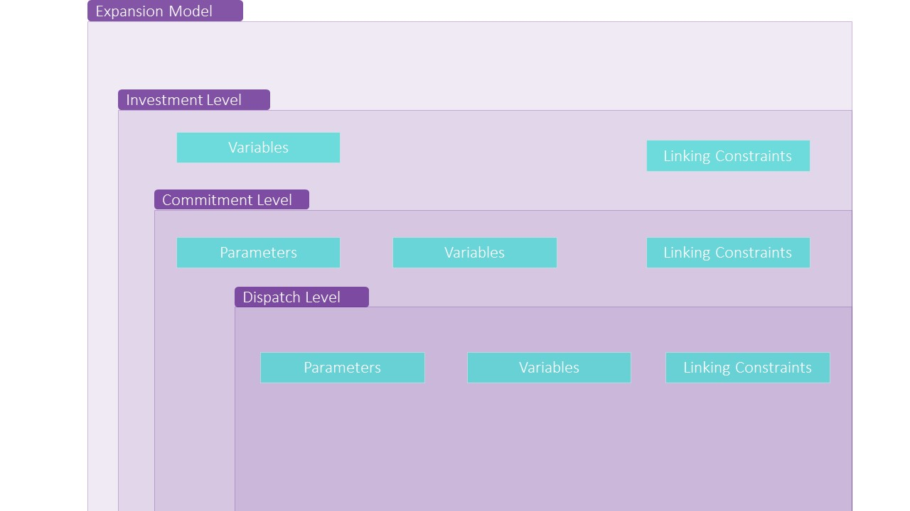

.. _Modeling:

Modeling 
=========

The `ExpansionPlanningModel()` class provides a Pyomo-based
implementation of a modular, flexible, Generalized Disjunctive
Programming (GDP) formulation for power infrastructure planning
problems. This formulation creates a generalized generation and
transmission planning model represented as a dispatch problem
contained in a unit commitment and an investment problem for a
representative period (primarily linked on the commitment
periods). The figure below shows a graphical representation of these
different levels, how they are connected in the formulation, and the
components required in each level.

Model Structure
---------------

To formulate this problem, we split the formulation into four main
levels:

1. **Data allocation level** that defines all the model structure
   components and declares all the relevant data in the model.

2. **Investment level** that defines all relevant investment variables
   and constraints that include the reserve margin, peak load, the
   maximum thermal investment in a region, etc..

3. **Commitment level** that determines the status of the generators
   with the alternatives `on`, `off`, `startup`, or `shutdown` using
   Generalized Disjunctive Programming (GDP) to represent the
   commitment decision using disjunctions.

4. **Dispatch level** that determines the amount of power provided by
   each of the generators, including flow balances. 

The construction of the model involves the steps (a) to (j) and each
step is linked to any of the four levels described above. In the
following section we describe each step while providing a detailed
description of the procedure followed by example code.

Steps
^^^^^

**Level 1** 

(a) The first step to create this model is to import the needed
    libraries.
   
.. code-block::

   import json
   import numpy as np
   import math
   from math import ceil
   
   # Import Pyomo components
   from pyomo.environ import * 
   from pyomo.environ import units as u
   from pyomo.common.timing import TicTocTimer
   from pyomo.repn.linear import LinearRepnVisitor
   
   from egret.data.model_data import ModelData
   from egret.model_library.transmission.tx_utils import scale_ModelData_to_pu
   from config_options import _get_model_config

   # Import IDAES-GTEP functions 
   from gtep.gtep_model import model_data_references
   from gtep.gtep_model import model_create_investment_stages
   from gtep.gtep_model import create_objective_function

(b) Create the expansion planning model as a Python `class`, including
    a set of parameters as arguments of the function.

.. code-block::

   class ExpansionPlanningModel:
        """A generalized generation and
           transmission expansion planning model.
	"""

        def __init__(
            self,
            config=None,
            stages=1,
            formulation=None,
            data=None,
            num_reps=3,
            len_reps=24,
            num_commit=24,
            num_dispatch=4,
        ):
            
            self.stages = stages
            self.formulation = formulation
            self.data = data
            self.num_reps = num_reps
            self.len_reps = len_reps
            self.num_commit = num_commit
            self.num_dispatch = num_dispatch
            self.config = _get_model_config()
            self.timer = TicTocTimer()

(c) Inside this class, create a concrete Pyomo model object using the
    `ConcreteModel` component. In this model, we define the following
    time-dependent parameters: representative period length, number of
    commitment and dispatch periods, and commitment and dispatch
    period length. The values are set based on the given data to the
    problem.

.. code-block::

	def create_model(self):
        """Create concrete Pyomo model object associated with the ExpansionPlanningModel"""

        self.timer.tic("Creating GTEP Model")
        m = ConcreteModel()

        if self.data is None:
            raise
        elif type(self.data) is list:
            m.data_list = self.data
            m.md = scale_ModelData_to_pu(self.data[0])
        
        model_set_declaration(
            m, self.stages, 
            rep_per=[i for i in range(1, self.num_reps + 1)]
        )
        m.representativePeriodLength = Param(
            m.representativePeriods, 
            within=PositiveReals, 
            default=24, 
            units=u.hr
        )
        m.numCommitmentPeriods = Param(
            m.representativePeriods,
            within=PositiveIntegers,
            default=2,
            initialize=self.num_commit,
        )
        m.numDispatchPeriods = Param(
            m.representativePeriods,
            within=PositiveIntegers,
            default=2,
            initialize=self.num_dispatch,
        )
        m.commitmentPeriodLength = Param(
            within=PositiveReals, 
            default=1, 
            units=u.hr
        )
        m.dispatchPeriodLength = Param(
            within=PositiveReals, 
            default=15, 
            units=u.min
        )

(d) Create and label data in the model. For this, we call a defined
    function to tie input data directly to the model. Refer to
    :ref:`Data` in this documentation to know more details about the
    data added to this function and required by the model class.

.. code-block::

   model_data_references(m)

(e) Create investment blocks and linking constraints. To do this, we
    call the following function that manages retirements and links
    operational units in a given investment stage.

.. code-block::

   model_create_investment_stages(m, self.stages)

This function includes the three relevant levels in the model
formulation: investment, commitment, and dispatch problems. To define
them, this function includes a set of variables, constraints, and
investment stages as Pyomo blocks and sets of linking constraints to
track the operational, installed, and retired states for generators
and branches. Find more details below about each part.

**Level 2**

(f) **Investment Level** defines the representative period and all
    relevant variables and constraints for the investment, dispatch,
    and commitment problems. For the investment constraints, we
    include the operational alternatives for the generator and
    branches as discrete decisions using disjunctions. Table 1 shows a
    description of these terms.

.. table:: Table 1: Investment components in the
           `ExpansionPlanningModel()` class including parameters,
           variables, constraints, and discrete decisions.
   :widths: 20 20 30

   ============================================= =================== =================================
   Component                                     Type                Description
   ============================================= =================== =================================
   `representativePeriods`                       Set       
   `commitmentPeriods`                           Set
   `dispatchPeriods`                             Set
   `carbonTax`                                   Parameter
   `renewableCapacity`                           Parameter           Maximum output of each renewable
	                                                             generator
   `renewableSurplusRepresentative`              Variable
   `consistent_commitment_shutdown`              Logical constraint
   `consistent_commitment_off_after_shutdown`    Logical constraint
   `consistent_commitment_startup`               Logical constraint
   `consistent_commitment_on_after_startup`      Logical Constraint
   `consistent_commitment_uptime`                Logical Constraint
   `consistent_commitment_shutdown_after_uptime` Logical Constraint
   `consistent_commitment_downtime`              Logical Constraint 
   `consistent_commitment_start_after_downtime`  Logical Constraint
   `maxThermalInvestment`                        Parameter
   `maxRenewableInvestment`                      Parameter
   `renewableOperational`                        Variable
   `renewableInstalled`                          Variable
   `renewableRetired`                            Variable
   `renewableExtended`                           Variable
   `quotaDeficit`                                Variable
   `operatingCostInvestment`                     Variable
   `expansionCost`                               Variable
   `renewableCurtailmntInvestment`               Variable
   `renewable_generation_requirement`            Constraint          Minimum per-stage renewable
	                                                             generation requirement
   `operatingCostInvestment`                     Constraint          Operating costs for investment
	                                                             period
   `investment_cost`                             Constraint          Investment cost for each
	                                                             investment period
   `renewable_curtailment_cost`                  Constraint          Curtailment penalties for
	                                                             investment period
   `investStatus`                                Disjunction 
   `genOPerational`                              Disjunct
   `genInstalled`                                Disjunct
   `genRetired`                                  Disjunct
   `genDisabled`                                 Disjunct
   `genExtended`                                 Disjunct
   `branchinvestStatus`                          Disjunction
   `branchOPerational`                           Disjunct
   `branchInstalled`                             Disjunct
   `branchRetired`                               Disjunct
   `branchDisabled`                              Disjunct
   `branchExtended`                              Disjunct
   ============================================= =================== =================================

 
**Level 3**

(g) **Commitment level** includes the linking constraints as logical
    constraints using the Pyomo `LogicalConstraint` component. Table 2
    includes more details about these constraints.

.. table:: Table 2: Commitment components in the
           `ExpansionPlanningModel()` class including parameters,
           variables, constraints, and discrete decisions.
   :widths: 20 20 30

   ============================================= =================== =================================
   Commitment Terms                              Type                Description
   ============================================= =================== =================================
   `commit_active_gens_only`                     Logical constraint  Generators cannot be committed
	                                                             unless they are operational or
								     just installed
   `renewableSurplusCommitment`                  Expression          Total renewable surplus/deficit for
                                                                     commitment
   `operatingCostCommitment`                     Expression          Define total operating costs for
	                                                             commitment
   `renewableCurtailmentCommitment`              Expression          Define total curtailment for
	                                                             commitment
   `genStatus`                                   Disjunction         Defines the alternatives on
	                                                             generator status: on, startup,
								     shutdown, and off 
   `genOn`                                       Disjunct            Includes operation equations when
	                                                             generators are on
   `genStartup`                                  Disjunct            Includes ramp up constraints for
	                                                             generators starting up
   `genShutDown`                                 Disjunct            Includes ramp down constraints
	                                                             for generators shutting down
   `genOff`                                      Disjunct
   ============================================= =================== =================================

.. table:: Table 3: Linking constraints in the
           `ExpansionPlanningModel()` class
   :widths: 20 30

   ==================================== =============================================================
   Constraint                           Description
   ==================================== =============================================================
   `gen_stats_link`                     Linking generator investment status
   `renewable retirement`               Renewable generation retirement relationships
   `renewable_stats_link`               Total renewable generation at a given stage
   `consistent_operation`               If a generator is online at time `t`, it should be online or
                                        installed at time `t-1`
   `consistent_operation_future`        If a generator is online at time `t`, it can be online,
                                        extended, or retired at time `t+1`
   `full_retirement`                    If a generator is retired at time `t-1`, it should be disable
                                        at time `t`
   `consistent_extended`                If a generator is extended at time `t`, it must stay extended
                                        or retired at time `t`
   `full_investment`                    Installation in period `t-1` implies operational in period
                                        `t`
   `consistent_branch_operation`        If a branch is online at time `t`, it must have been online
	                                or installed at time t-1
   `consistent_branch_operation_future` If a branch is online at time `t`, it must be online,
	                                extended, or retired at time `t+1`
   `full_branch_retirement`             Retirement in period `t-1` implies disabled in period `t`
   `consistent_branch_disabled`         If a branch is disabled at time `t-1`, it must stay disabled
	                                or be installed at time `t`
   `consistent_branch_extended`         If a branch is extended at time `t-1`, it must stay extended
	                                or be retired at time `t`
   `full_branch_investment`             Installation in period `t-1` implies operational in period `t`
   ==================================== =============================================================

**Level 4**
 
(h) **Dispatch Level** includes all variables and constraints for the
    dispatch periods. Table 4 includes more details about these
    components.
  
.. table:: Table 4: Dispatch components in the
           `ExpansionPlanningModel()` class including parameters,
           variables, constraints, and discrete decisions.
   :widths: 20 20 30

   ============================================= =================== =================================
   Component                                     Type                Description
   ============================================= =================== =================================
   `thermalGeneration`                           Variable
   `renewableGneration`                          Variable
   `renewableCurtailment`                        Variable
   `renewableGenerationSurplus`                  Expression          Surplus per generator
   `renewableCurtailmentCost`                    Expression          Curtailment cost per generator
   `generatorCost`                               Expression          Generator cost
   `loadShedCost`                                Expression          Load shed cost per bus
   `powerFlow`                                   Variable            Power flow
   `must_use_active_branches`                    Logical constraint  If a branch is in use, it must be
	                                                             active
   `cannot_use_inactive_branches`                Logical constraint  If a branch is not in use, it must
	                                                             be inactive
   `spinningReserve`                             Variable
   `quickstartReserve`                           Variable
   `flow_balance`                                Constraint          Energy balance
   `branchInUseStatus`                           Disjunction
   `branchInUse`                                 Disjunct            Creates variables for the buses
	                                                             associated with this branch.
								     Here we include the dc power
								     flow equations.
   `branchNotInUse`                              Disjunct            Fix power flow to zero
   ============================================= =================== =================================

(j) Once the data and linking constraints are included, we include the
    total cost as the objective function using the Pyomo `Objective`
    component. The total cost includes not only investment costs, but
    also operating, expansion, and penalty costs. These are included
    in the following function.

.. code-block::

   create_objective_function(m)

.. currentmodule:: gtep.gtep_model

.. automodule:: gtep
    :members:

.. automodule:: gtep.gtep_model
    :members: 

