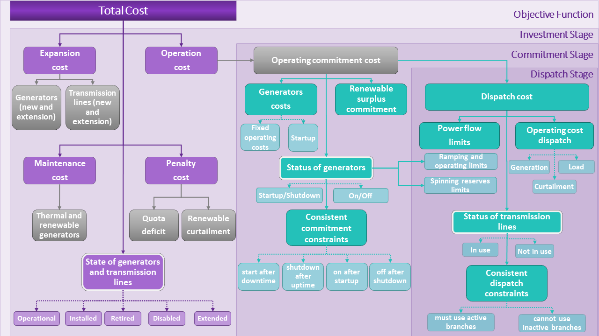

.. _Modeling:

Modeling 
========

The :class:`ExpansionPlanningModel<gtep.gtep_model.ExpansionPlanningModel>` class implements a modular Generalized
Disjunctive Programming (GDP) formulation to produce a generalized
model for generation, transmission, and expansion planning (GTEP) for
power infrastructure problems. This formulation is represented as a
dispatch problem integrated within a unit commitment and an investment
problem for a specified representative period. Each of these problems
is considered a "stage" in this formulation and is defined using a
Pyomo `Block` component.

Figure 1 shows a graphical representation of these stages, including
the relevant model components (variables and constraints), and the
terms that connect the stages in the formulation. Note in Figure 1
that the commitment stage serves as the primary link between the
stages.

   Figure 1. Modular representation of the three stages included in
   the GTEP model formulation.

In the following section, we provide a more detailed explanation of
these stages and how they are defined in the model.

Model Formulation and Construction
----------------------------------

To develop the GTEP model in Figure 1, we start by splitting the
formulation into three key stages:

1. **Investment stage**: Estimates relevant investment costs such as
   installation, expansion (which includes the installation of new
   selected generation units), operating costs, penalty, and
   maintenance costs. These costs include representative costs for
   both thermal and renewable generators as well as transmission
   equipment (e.g., transmission lines). Additionally, it declares a
   discrete decision (represented as a disjunction through the GDP
   formulation) to determine the operational state of the generation
   and transmission equipment (operational, retired, etc.) that can
   potentially influence the investment costs.

2. **Commitment stage**: Determines the operational status of the
   generators (set as a disjunction) while considering relevant
   operational costs and constraints to ensure a reliable power
   generation service. Additionally, it establishes operating limits
   considering the availability of the equipment from the dispatch
   stage.

3. **Dispatch stage**: Defines the status of transmission lines using
   a discrete decision (set as a disjunction) while considering
   operational costs, operability limits (such as power flow, ramping,
   reserves, etc.), and constraints to ensure the effective use of the
   active power lines.

Additionally, we include a data allocation step (prior to the
formulation of the three stages) that assigns all relevant operating
and cost parameters of the model. Since we are considering this as a
data preprocessing step, not a stage in the formulation, this step is
not represented in Figure 1.

Below we outline the steps we followed to construct the GTEP
model. Note that the first four steps correspond directly to the
stages described above (in some steps, the description is accompanied
by example code).

**Step 1**: Data allocation

(a) The initial step to create this model is to import the necessary
    libraries.
   
    .. code-block::

       import json
       import numpy as np
       import math
       from math import ceil
   
       # Import Pyomo components
       from pyomo.environ import * 
       from pyomo.environ import units as u
       from pyomo.common.timing import TicTocTimer
       from pyomo.repn.linear import LinearRepnVisitor
   
       from egret.data.model_data import ModelData
       from egret.model_library.transmission.tx_utils import scale_ModelData_to_pu
       from config_options import _get_model_config

       # Import IDAES-GTEP functions 
       from gtep.gtep_model import model_data_references
       from gtep.gtep_model import model_create_investment_stages
       from gtep.gtep_model import create_objective_function

(b) Continue the creation of the GTEP model by including a new Python
    `class`, which includes a set of relevant parameters for the
    solution of the model, as arguments of the function.

    .. code-block::

       class ExpansionPlanningModel:
            """A generalized generation and
               transmission expansion planning model.
	    """

            def __init__(
                self,
                config=None,
                stages=1,
                formulation=None,
                data=None,
                num_reps=3,
                len_reps=24,
                num_commit=24,
                num_dispatch=4,
            ):
            
                self.stages = stages
                self.formulation = formulation
                self.data = data
                self.num_reps = num_reps
                self.len_reps = len_reps
                self.num_commit = num_commit
                self.num_dispatch = num_dispatch
                self.config = _get_model_config()
                self.timer = TicTocTimer()

(c) Inside the `ExpansionPlanningModel()` class, we create a concrete
    Pyomo model object using the `ConcreteModel` component. Within
    this model, we define several time-dependent parameters for each
    stage, including:

    (1) **Number of Commitment and Dispatch Periods**, which specifies
        the total number of periods allocated for the commitment and
        dispatch stages. These are key to determine the operational
        status of generators over time and how power flows are managed
        across the transmission network.
    (2) **Length of Commitment and Dispatch Periods**, which defines
        the duration of each commitment and dispatch periods. These
        allow us to model the time intervals during which generators can
        change their status (on, off, etc.) and evaluate operational
        decisions made during the power dispatch stage.

    .. code-block::

       def create_model(self):
           """Create concrete Pyomo model object associated with the ExpansionPlanningModel"""

           self.timer.tic("Creating GTEP Model")
           m = ConcreteModel()
    
           if self.data is None:
               raise
           elif type(self.data) is list:
               m.data_list = self.data
               m.md = scale_ModelData_to_pu(self.data[0])
            
           model_set_declaration(
               m, self.stages, 
               rep_per=[i for i in range(1, self.num_reps + 1)]
           )
           m.representativePeriodLength = Param(
               m.representativePeriods, 
               within=PositiveReals, 
               default=24, 
               units=u.hr
           ) 
           m.numCommitmentPeriods = Param(
               m.representativePeriods,
               within=PositiveIntegers,
               default=2,
               initialize=self.num_commit,
           )
           m.numDispatchPeriods = Param(
               m.representativePeriods,
               within=PositiveIntegers,
               default=2,
               initialize=self.num_dispatch,
           )
           m.commitmentPeriodLength = Param(
               within=PositiveReals, 
               default=1, 
               units=u.hr
           )
           m.dispatchPeriodLength = Param(
               within=PositiveReals, 
               default=15, 
               units=u.min
           )

(d) Create and label data in the model using a data pre-processing
    function. This function ties the input data directly to the model
    by assigning values to all parameters. Look at the :ref:`Data` section for
    more information.

    .. code-block::

       model_data_references(m)

 
**Step 2:** Define Investment Stage

(a) We define the investment stage using a Pyomo `Block` component.
    This block includes all relevant cost
    variables and constraints associated with generation and
    transmission equipment including operating, expansion,
    maintenance, and penalty costs. Additionally, it incorporates a
    discrete decision using a Pyomo.GDP `Disjunction` component to
    define the operational status of generation and transmission
    equipment, while considering a series of linking constraints to
    monitor the operational, installed, and retired states of the
    equipment. Table 1 presents a list of these key components,
    including their definition.

    In the GTEP model, we include the pre-defined function below that
    incorporates all these components.
    
    .. code-block::

       model_create_investment_stages(m, self.stages)

    During the calculation of the operating costs in this stage, we
    establish a connection with the commitment and dispatch
    stages. For this, we define a second Pyomo `Block` component
    for the commitment stage. Figure 2
    illustrates this interconnection and how these relationships
    propagate throughout the formulation.
    
    .. figure:: ../images/model_investment_stage.png
       :align: center

       Figure 2. Modular representation of the investment stage.

    .. table:: Table 1: Model components (parameters, variables,
               constraints, and disjunctions) in the investment stage
       :widths: 20 15 35

       ==================================== =========================== ===========================================================================
       Component                            Type                        Definition
       ==================================== =========================== ===========================================================================
       `representativePeriods`              Set                         Representative periods for the investment stage
       `commitmentPeriods`                  Set                         Commitment periods in the investment stage
       `dispatchPeriods`                    Set                         Dispatch periods in the investment stage
       `maxThermalInvestment`               Parameter                   Maximum investment for thermal generators
       `maxRenewableInvestment`             Parameter                   Maximum investment for renewable generators
       `renewableSurplusRepresentative`     Variable                    Minimum renewable generation requirement per stage
       `renewableOperational`               Variable                    Power provided to the grid by renewable generator at operation
       `renewableInstalled`                 Variable                    Power provided to the grid by renewable generator at installation
       `renewableRetired`                   Variable                    Power removed from the grid if renewable generator is retired
       `renewableExtended`                  Variable                    Power provided to the grid if renewable generator lifetime is extended
       `quotaDeficit`                       Variable                    Deficit for investment stage                   
       `expansionCost`                      Variable                    Cost of investment for new installed generators and transmission lines
       `renewableCurtailmentInvestment`     Variable                    Curtailment penalties for investment stage
       `operatingCostInvestment`            Expression                  Operating cost for investment period
       `investStatus`                       Disjunction                 Discrete decision to determine the status for generation investment. The
                                                                        alternatives, expressed as `disjuncts` in the model are: `genOperational`,
                                                                        `genInstalled`, `genRetired`, `genDisabled`, and `genExtended`
       `branchInvestStatus`                 Disjunction                 Discrete decision to determine the status for the transmission equipment
                                                                        investment. The alternatives (as disjuncts) are: `branchOPerational`,
									`branchInstalled`, `branchRetired`, `branchDisabled`, and `branchExtended`
       `gen_stats_link`                     Constraint                  Propagate the thermal generators status considering their previous state
       `renewable_stats_link`               Constraint                  Propagate the renewable generators status considering their previous state
       `renewable_retirement`               Constraint                  Propagate the renewable generation retirement status based on previous state
                                                                        and lifetime of renewable equipment
       `consistent_extended`                Logical constraint          If a generator is extended at time `t`, it must stay extended or retired at
	                                                                time `t`
       `consistent_branch_operation`        Logical constraint          If a branch is online at time `t`, it must have been on or installed at
                                                                        time t-1
       `consistent_branch_operation_future` Logical constraint          If a branch is online at time `t`, it must be on, extended, or retired at
                                                                        time `t+1`
       `consistent_branch_extended`         Logical constraint          If a branch is extended at time `t-1`, it must stay extended or be retired
                                                                        at time `t`
       `consistent_operation`               Logical constraint          If a generator is online at time `t`, it should be online or installed at
                                                                        time `t-1`
       `consistent_operation_future`        Logical constraint          If a generator is online at time `t`, it can be online, extended, or
                                                                        retired at time `t+1`
       `consistent_branch_disabled`         Logical constraint          If a branch is disabled at time `t-1`, it must stay disabled or be
                                                                        installed at time `t`
       `full_retirement`                    Logical constraint          If a generator is retired at time `t-1`, it should be disable at time `t`
       `full_investment`                    Logical constraint          Installation in period `t-1` implies operational in period `t`
       `full_branch_retirement`             Logical constraint          Retirement in period `t-1` implies disabled in period `t`
       `full_branch_investment`             Logical constraint          Installation in period `t-1` implies operational in period `t`
       ==================================== =========================== ===========================================================================
       
**Step 3**: Define Commitment Stage

(a) Within the commitment block defined in step 2(a), we incorporate
    the commitment periods and introduce relevant components to ensure
    that the operation of transmission and generation equipment aligns
    with their designated statuses. During this stage, we also
    introduce cost and operational constraints that are contingent
    upon the commitment decisions and the outcomes of the dispatch
    stage. Table 2 provides a detailed overview of the components in
    the commitment stage of the model formulation.

    Figure 3 illustrates the various components utilized in this
    stage, highlighting the terms that connect to the dispatch
    stage.
    
    .. figure:: ../images/model_commitment_stage.png
       :align: center

       Figure 3. Modular representation of the commitment stage.

    .. table:: Table 2: Components in the commitment stage
       :widths: 20 15 35

       ============================================= =================== =============================================================================
       Component                                     Type                Description
       ============================================= =================== =============================================================================
       `dispatchPeriods`                             Set                 Number of dispatch periods
       `carbonTax`                                   Parameter           Carbon tax
       `renewableSurplusCommitment`                  Expression          Total renewable surplus/deficit for commitment
       `operatingCostCommitment`                     Expression          Define total operating costs for commitment
       `renewableCurtailmentCommitment`              Expression          Define total curtailment for commitment
       `genStatus`                                   Disjunction         Discrete decision to set the status of the generation equipment. The
                                                                         alternatives, as `disjuncts` are: `genOn`, `genStartup`, `genShutDown`, and
									 `genOff`.
       `consistent_commitment_shutdown`              Logical constraint
       `consistent_commitment_off_after_shutdown`    Logical constraint
       `consistent_commitment_startup`               Logical constraint
       `consistent_commitment_on_after_startup`      Logical Constraint
       `consistent_commitment_uptime`                Logical Constraint
       `consistent_commitment_shutdown_after_uptime` Logical Constraint
       `consistent_commitment_downtime`              Logical Constraint 
       `consistent_commitment_start_after_downtime`  Logical Constraint
       `commit_active_gens_only`                     Logical constraint  Generators cannot be committed unless they are operational or just installed
       ============================================= =================== =============================================================================

 
**Step 4:** Define Dispatch Stage

(a) This stage incorporates all key variables and constraints
    associated with the dispatch problem, including operational limits
    for generation and curtailment, as well as definitions for load
    shedding and surplus dispatch. Additionally, this stage outlines
    the costs associated with these variables. Table 3 and Figure 4
    provide a more detailed description of these components and their
    definitions in the formulation.
    
    .. figure:: ../images/model_dispatch_stage.png
       :align: center

       Figure 4. Modular representation of the dispatch stage.

  
    .. table:: Table 3: Components in dispatch stage
       :widths: 20 15 35

       ================================ =================== =========================================================================================
       Component                        Type                Description
       ================================ =================== =========================================================================================
       `thermalGeneration`              Variable            Thermal generation power during the dispatch stage
       `renewableGeneration`            Variable            Renewable generation power during the dispatch stage
       `renewableCurtailment`           Variable            Amount of curtailed renewable power
       `spinningReserve`                Variable            
       `quickstartReserve`              Variable
       `powerFlow`                      Variable             Power flow
       `renewableGenerationSurplus`     Expression           Power surplus per renewable generator
       `renewableCurtailmentCost`       Expression           Cost of curtailment per renewable generator
       `generatorCost`                  Expression           Thermal generator cost based on the fuel cost
       `loadShedCost`                   Expression           Load shed cost per bus
       `branchInUseStatus`              Disjunction          Discrete decision to determine the status of the transmission equipment. The alternatives
                                                             are: `branchInUse` (which includes the DC OPF equations) and `branchNotInUse` (which
							     fixes power flow to zero).
       `must_use_active_branches`       Logical constraint   If a branch is in use, it must be active
       `cannot_use_inactive_branches`   Logical constraint   If a branch is not in use, it must be inactive
       ================================ =================== =========================================================================================

**Step 5:** Define objective function
    Once the data and blocks for the different stages are
    incorporated, we define the total cost as the objective function
    using the Pyomo `Objective` component. The total cost includes not
    only investment costs, but also operating, expansion, and penalty
    costs that connect all the stages in the formulation. The
    objective function is integrated within the following pre-defined
    function.

    .. code-block::

       create_objective_function(m)

.. currentmodule:: gtep.gtep_model

.. automodule:: gtep
    :members:

.. automodule:: gtep.gtep_model
    :members: 

